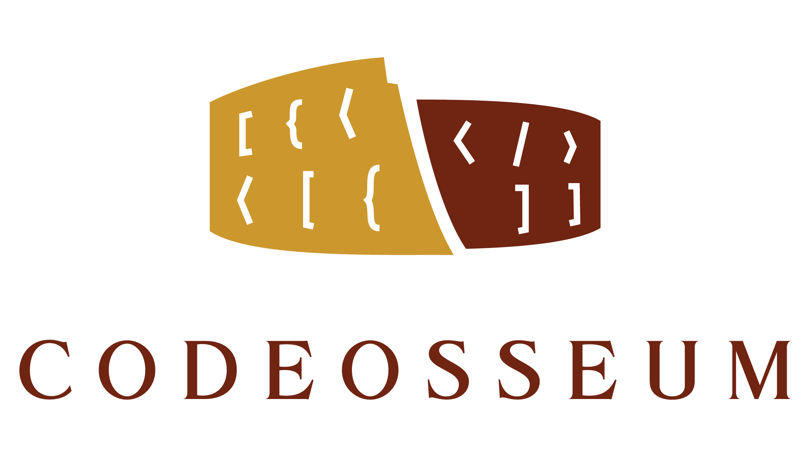

  

Ares: Central web server for Codeosseum.

# Ares

Ares is the central web server of Codeosseum, responsible for player management, matchmaking and match management.

Ares is an event-driven Spring-based monolith. Why a monolith? It's always easier to start off with a monolith having separation in mind, than going the microservice-hell from day one. For a single dev at least :)

## Dependencies

In order to run Ares you'll need the following:

  * Java 8,
  * MongoDB.

## Run

Simply run the following command in the repository root:

~~~~
$ ./mvnw spring-boot:run
~~~~

## Configuration

Ares can be configured using the following properties:

~~~~YAML
server:
  # The HTTP port, Ares will be listening to.
  port: 8000

# Root log level.
logging.level.root: INFO

# Log level of Ares-specific classes.
logging.level.com.codeosseum.ares: DEBUG

spring:
  data:
    mongodb:
      # Connection URI to MongoDB.
      uri: mongodb://127.0.0.1:27017/codeosseum

codeosseum:
  heartbeat:
    # Timeout check interval.
    checkSeconds: 10
    # Timeout after which unresponsive dedicated servers will be dropped.
    timeoutSeconds: 120

  eventbus:
    # The number of threads processing the events on the event bus.
    executorThreadCount: 2

  matchmaking:
    schedule:
      # Initial delay before trying to make matches.
      initialDelaySeconds: 10
      # Delay between matchmaking attempts.
      delaySeconds: 10
~~~~

## License

Ares is licensed under the [Apache License 2.0](LICENSE).

## Acknowledgements

  

    Supported by the ÚNKP-18-2 New National Excellence Program of the Ministry of Human Capacities.

